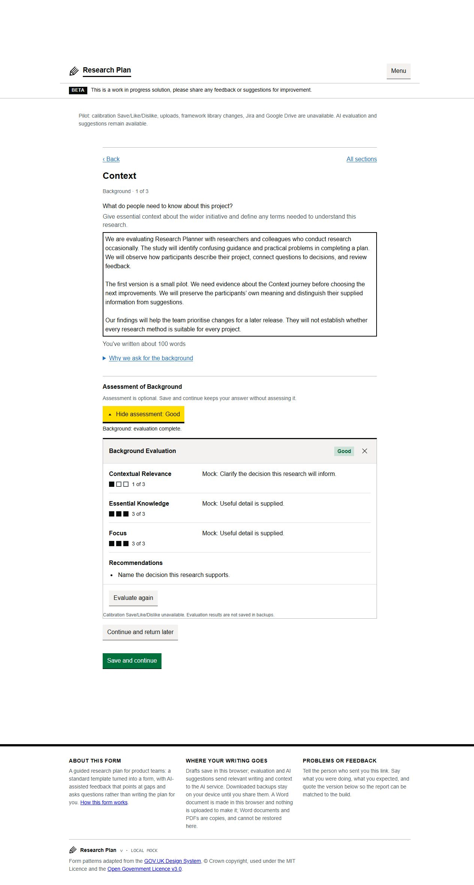
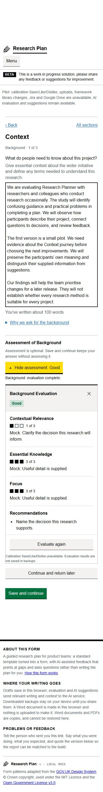

# RPA-162: Context assessment beside each answer

This implements the first slice of workflow A selected by Max on 5 October 2026.
The existing Background, Goal and Problem Statement answers each have an explicit
**Assess this answer** action. Feedback opens below the editor at the existing
reading width, with each criterion, its explanation and recommendations visible.
Field titles and position are shown without changing the section heading.

Base: `origin/main` at `2fb9f1b80d41d873d1ffd3c66be449177a434b62`.
Branch: `codex/rpa-162-context-assessment` in the managed implementation worktree.
Tracked in [RPA-162](https://turingtestable.atlassian.net/browse/RPA-162).
Max authorised PR, merge and Jira closeout on 6 October. The earlier overnight
checkpoint is historical; final verification is recorded separately below.

## Behaviour and boundaries

Navigation and Save and continue do not request assessment. The existing rubric,
provider settings, request retries, calibration restrictions and shared limit of
two concurrent requests are reused. Writing stays editable during requests.
Duplicate actions are disabled. A Context request queued for changed writing is
skipped; an arriving response for an older answer is discarded. Previous feedback
stays visible and marked out of date until successfully reassessed.

**Continue and return later** is available for unavailable or outdated assessment,
and whenever any criterion scores below 3, even if the existing overall label is
Good. It uses ordinary Save and continue validation. Required writing and existing
cross-section locks remain unchanged. A reminder follows that field during this
session; authors can clear it, or a fresh assessment with every criterion scoring
3 clears it. Reload, successful backup import, Clear Form and profile changes reset
feedback and reminders. Drafts and backups still preserve the writing.

Keyboard activation preserves focus on a useful feedback/reassessment/retry
control after the initiating action is disabled or hidden. A user who moves to
another control while waiting keeps that focus. Feedback can be collapsed and
reopened. Calibration Save/Like/Dislike stay unavailable in the restricted pilot.

Optional refinement is the next separate slice. This change adds no rewrite
endpoint or automatic replacement of writing. The rewrite contract, acceptance
flow and revised cost assumptions remain to be reviewed before real provider use.
The known sticky-header obstruction and textarea navigation collapse remain
separate fixes. Research retains its section evaluation action and structured
scoring behaviour.

## Review demonstration

Run `node test/manual/context-assessment-preview.cjs` from this worktree. The
[local preview](http://127.0.0.1:8966/) uses only allowlisted repository assets,
synthetic writing and mocked assessment. It never loads the backend, .env, provider
SDK, submissions or calibration storage. It is currently running on loopback.

1. Assess Background; its writing, individual scores and recommendations remain
   visible together. Use the named control to collapse and reopen the assessment.
2. Choose Continue and return later, then Back. The field reminder is visible and
   no assessment is initiated by moving between fields.
3. Edit the answer. Prior feedback is labelled out of date. Update evaluation is
   an explicit action. Add `[slow]` to inspect pending behaviour and edit again
   while waiting to see the obsolete response discarded.
4. Add `[fail]` and request assessment to simulate a failure. Writing and previous
   feedback remain. Remove the marker and use the explicit retry. Add `[ready]`
   to simulate all criteria scoring 3 and clearing the reminder.
5. Try Goal and Problem Statement, the existing Back/check-answer routes, and a
   narrow viewport. Saving an unanswered required field still shows its error.

The mocked markers are exclusive to this preview server and do not alter the
production evaluation contract. Screenshots show synthetic local feedback:

## Validation

See [verification](VERIFICATION.md) for final automated and browser evidence.
The additional workflow tests replace Context assertions that assumed the old
section-level trigger; Research's section tests and existing preservation tests
remain. The retry tests exercise the real HTTP handler against a stub provider.
No validation used a real provider or a deployed environment.
