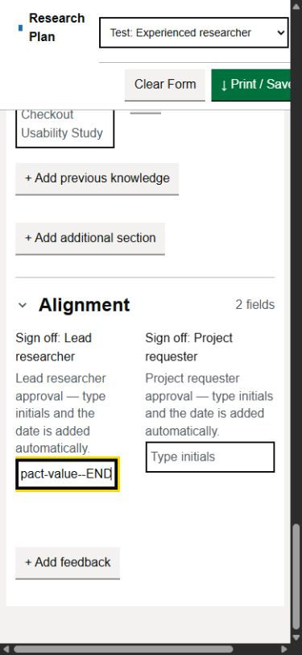
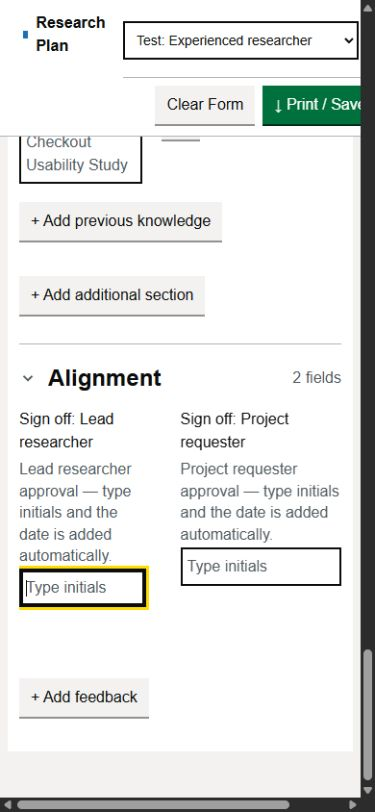

# RPA-49 investigation — local review, no application fix

Date: 7 September 2026. Ticket: https://turingtestable.atlassian.net/browse/RPA-49

No retained input or table-wrapper offset reproduced in the available browser.
Max subsequently reported that all requested standalone Windows Chrome manual
checks passed and approved closing RPA-49. Application code is unchanged; no
speculative scroll reset is needed. This handoff preserves the investigation,
mock preview and evidence supporting closure as no longer reproducible.

## Manual acceptance

After the automated investigation, Max ran the supplied Chrome checklist and
reported **"all passed"**, then requested ticket closure and an evidence PR.
The checklist covered desktop and narrow widths, long current compact values
with the caret at the end, native Clear Form confirmation/cancellation, normal
left edges without reload, and reset preservation checks for paired rows,
Other controls, timeline, Last updated and mock evaluations.

Standalone Chrome results are **user-reported acceptance**. The measurements
and screenshots below remain the agent's in-app Chromium evidence with mocked
confirmation. No standalone Chrome version, native-dialog recording or new
Chrome after-reset screenshot was supplied; do not relabel the automated images.

## Verified setup

- Dedicated app-created managed worktree: `C:\Users\Max\.codex\worktrees\4c64\research-plan-app`.
- New branch: `codex/rpa-49-reset-horizontal-scroll`.
- Fresh `git fetch origin`: `origin/main` and HEAD both
  `50247941ca582dae1d2fa957155c5896a791147c`. Ancestry check passed.
- GitHub PR #32 is merged at that exact SHA, with RPA-51; its base includes
  RPA-53 (#31) and RPA-34 (#30).
- At investigation start, live Jira was Ready, assigned to Max Spiegel. No RPA-49 implementation branch
  or PR found before branch creation. Search matches were historical mentions
  in other tickets' PRs, not RPA-49 implementation work.
- Applicable ancestor AGENTS.md was empty; no repository or nested AGENTS.md
  found. Read `research/decisions/001-layout-and-navigation.md` and the repository
  research index. No layout, evaluation, or print changes were made.
- No credentials or `.env` were read, copied, modified, or used. No paid API
  calls or collaborator messages. Max subsequently authorized committing,
  pushing and merging this evidence PR after green CI, then closing Jira.

## Browser evidence and limits

Available automation was **Codex's in-app Chromium**, reporting Windows 10 / Win64
and Chrome/152.0.0.0. This is not a verified standalone Windows Chrome session:
the browser inventory exposed only the in-app browser, and requesting Chrome
returned `Browser is not available: chrome`.

The native Clear Form dialog blocked that tab's automation: the click timed out
in `Input.dispatchMouseEvent`, `getJsDialog()` returned undefined, and Escape and
close attempts timed out in `Emulation.setFocusEmulationEnabled`. A fresh tab
worked. Subsequent reset runs used the preview's explicitly labelled Mock Cancel
and Mock Confirm choices. Those choices return false/true from `window.confirm`
while executing the unchanged application's real Clear Form handler. They do
not verify native-dialog rendering, focus restoration, or standalone Chrome.

The preview removes external Google scripts/font loading and mocks APIs locally.
Its measurements are therefore with the local fallback font.

Test value: `LEFT-EDGE-` + `long-compact-value-` repeated 35 times + `-END`
(679 characters; sign-off blur adds its existing date suffix). Fill each control,
click it and send a native End key. A programmatic locator End initially placed
the caret without visually scrolling, so it was not counted as reproduction.

| Current controls | Desktop 1440 x 1000 | Narrow 390 x 844 |
| --- | --- | --- |
| Jira Project, Lead researcher, Project requester | Input scrolls internally; no ancestor offset | Input scrolls internally; no scrolled field wrapper |
| Both Alignment sign-offs | Input scrolls internally; labels remain visible | Input scrolls internally; labels and reset placeholders remain visible |
| Methods combobox | Internal offset, no wrapper offset | Internal offset, no wrapper offset |
| Sample Size Other, Stage Other, additional Section name | Internal offset, no ancestor offset | Internal offset; HTML acquired a 1px offset during focus navigation |
| Project decision/readout and timeline date years | Existing automated date/reset coverage | Entered 2026, End; all year offsets zero |
| Action, Responsible, Previous Knowledge Name, Characteristic | Existing prose tests pass | Long values wrap; cleared with the real handler |

An initial supplemental desktop run used 1280 x 720; the nine compact text
controls were subsequently rerun at 1440 x 1000.

Desktop focused offsets were 4193–5056px. Narrow focused offsets were
4590–5339px. **Moving focus to Clear Form already returns each input's offset to
zero before the handler runs.** Confirmed reset then clears the text; all
surviving text controls have offset zero, Methods is rebuilt, and additional
sections are removed. All four table wrappers remained at offset zero.

Mock cancellation at both widths preserved every captured node, value, and
horizontal offset. Existing offline coverage separately verifies draft, timeline,
Last updated, evaluation and paired-row reset behavior.

At narrow width, the page retained a **1px HTML offset** and had 450px of content
inside a 375px client area (390px viewport with scrollbar). This is existing
page/toolbar overflow; it was not the clipped field-label/placeholder symptom,
and clearing the long text did not change that page width. It is recorded as an
observation, not used to justify a general layout or document-scroll fix.

Raw measurements: [rpa-49-browser-evidence.json](rpa-49-browser-evidence.json).
Screenshots show the same unchanged app before and after **reset**, not before
and after a code fix:





## Validation

- Inspected `clearForm` in app.js, `test/app-harness.js`, and existing reset tests.
- Focused suite: **52 passed, 0 failed** (characterization, dormant data,
  prose wrapping, RPA-51, RPA-53, RPA-34, Last updated).
- Full `npm test`: **123 passed, 0 failed**.
- `node --check`: app.js, textarea-autosize.js, test/app-harness.js,
  test/manual/rpa-49-preview.cjs — passed.
- `git diff --check` — passed; application tracked diff is empty.
- No new synthetic scroll regression was added: jsdom does not perform layout,
  and seeding an arbitrary retained offset would assume a defect not reproduced
  in the browser. Add focused confirmation/cancellation regressions only if the
  remaining Chrome check demonstrates an actual retaining element.
- Initial dependency installation hit Windows EACCES; the authorized elevated
  retry installed the lockfile successfully. The task-created npm cache was
  removed afterward.

## Mock preview and repeatable manual checklist

Running at http://127.0.0.1:8938/?test . Response header is
`X-RPA-Preview: RPA-49 4c64 mock`; served app.js exactly matches this worktree.
Existing previews on 8935 / 8936 / 8937 retained their original processes.

To restart from this worktree if necessary:

```powershell
node test/manual/rpa-49-preview.cjs
```

1. Open the URL in standalone Windows Chrome, at desktop and narrow widths.
   Leave **Reset confirmation = Native dialog**.
2. Enter the long test value into the controls listed above and move the caret
   to the end. Confirm Clear Form and check left edges without reloading.
3. Repeat and cancel. Check values, horizontal positions and UI state. Open
   **Reset scroll diagnostics (mock preview only)** to see before/after elements,
   offsets, viewport, browser string and whether each value stayed unchanged.
4. If a future run fails, retain the control name and diagnostics so a reopened
   investigation can target the demonstrated cause. Max's current run passed.

Closeout is approved. The PR records verification and a reusable mock preview;
it does not claim to fix application behavior.
