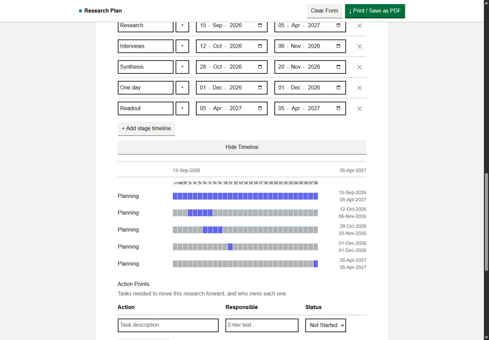
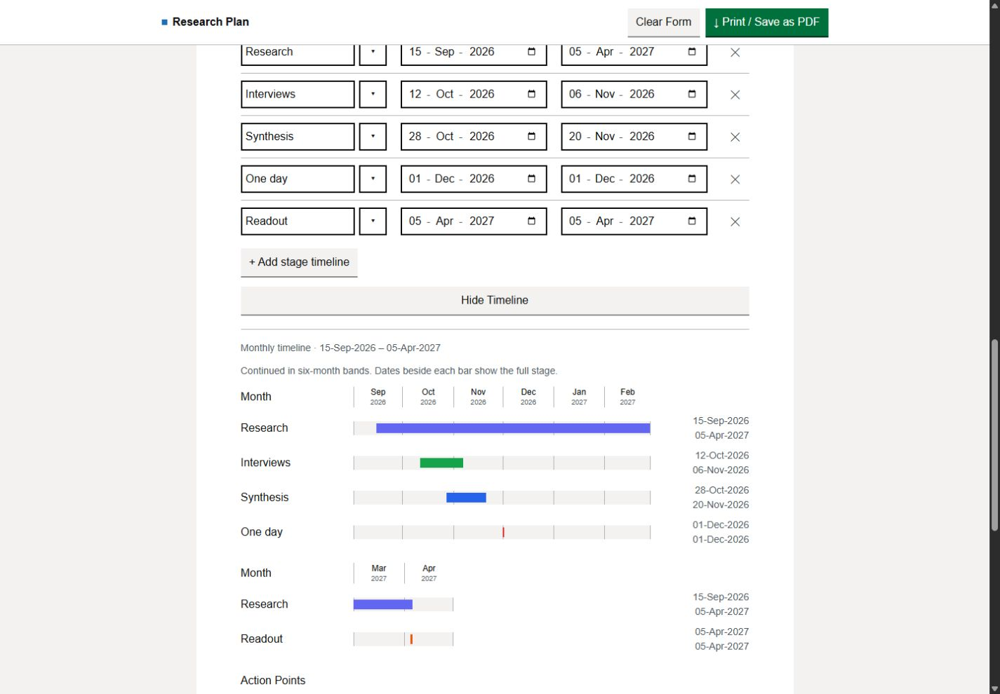
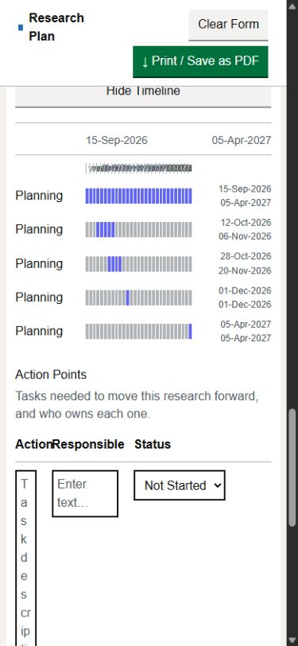
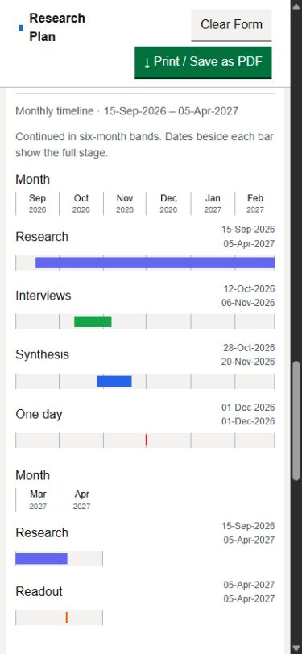
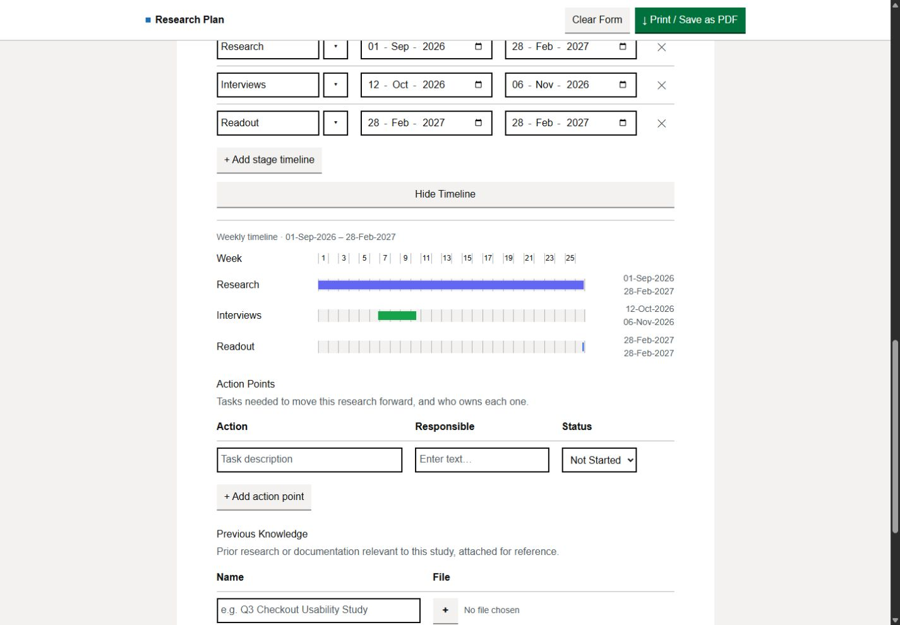
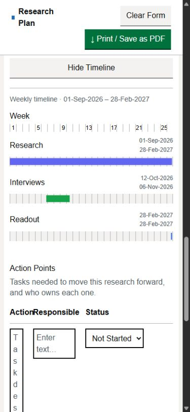

# RPA-65 local review

7 September 2026. Max reviewed the local result, reported "looks good on my end",
and explicitly approved ticket closeout and merge. This records his acceptance
without inferring that every individual native Chrome/PDF check was performed.

## Agreed presentation

Max revised the original monthly-after-eight-weeks request during implementation:

| Inclusive stage-derived span | Presentation |
| --- | --- |
| Up to 56 calendar days | Existing daily cells and plan-relative week labels |
| More than 56 days, through six calendar months | Weekly grid with continuous stage bars |
| More than six calendar months | Calendar-month grid with continuous stage bars |

The weekly/monthly grid does not round stage start, completion, or duration.
Each stage retains its exact dates, table order, first-seen color assignment,
and overlaps. Bars have accessible names including the full date range and
inclusive duration. A one-day stage stays a thin, visible mark.

The six-month threshold uses the start's calendar anniversary, with the
anniversary itself starting the seventh month. For September 1, February 28
is weekly and March 1 is monthly. For September 15, March 14 is weekly and
March 15 is monthly. If that anniversary day does not exist, only the display
threshold is clamped to the destination month's last day: August 31, 2026
gives February 28, 2027 as the first monthly completion date. Authored dates
are never clamped or migrated by the renderer.

Weeks start at the earliest valid stage date. Month grids show whole containing
months, so partial first/last months have truthful empty space. Longer charts
continue in six-month bands, with the same pixels per calendar day in every
band, including a short final band. Years appear under month names. Week labels
thin out when needed (every second week at desktop width, every fourth on the
tested narrow layout). On narrow screens, stage names and dates sit above bars.

The revised three-scale instruction comes from Max in this task and supersedes
the original two-scale acceptance criteria. The approved closeout will record
that decision in Jira alongside the merged PR and validation evidence.

## Setup and boundaries

- New app-created managed worktree: `C:\Users\Max\.codex\worktrees\e786\research-plan-app`.
- Branch: `codex/rpa-65-monthly-timeline-markers`.
- Fresh fetch verified HEAD and origin/main at
  `0df697ff54a82224860ccc0b980ab576069e7630`, PR #33's merge, including #32,
  #31 and #30. Required ancestry check passed.
- Live Jira RPA-65: Ready, assigned to Max Spiegel. GitHub branch and PR searches
  found no existing RPA-65 implementation. RPA-59 remains Ready and has not
  landed, so the range remains stage-derived.
- Applicable ancestor AGENTS.md was empty; no repository/nested AGENTS.md found.
  Read the research index and `research/decisions/001-layout-and-navigation.md`.
- No .env or credential inspection/loading, paid APIs or collaborator messages.
  Commit, push, PR, merge after green CI and Jira closeout were subsequently
  authorized by Max following local review.

## Changed files and related findings

Application changes are in app.js and style.css. package.json registers the new
offline test suite. Test fixtures, timezone runner, preview and review evidence
are under test/.

The existing draft version remains **7**, and the RPA-53 visibility/print
handlers are unchanged. The long renderer is a view helper in app.js; there is
no extracted model, stored range, migration or new plan-start state.

Two existing timeline interactions surfaced while checking the required
preservation behavior:

- Restored **Other** stage names were drawn as the default **Planning**, because
  restoration hides the select while its value can still be Planning. The
  chart's value reader now recognizes that hidden select and reads Other text.
  The baseline screenshots intentionally show the real old behavior.
- Removing a stage did not refresh the displayed chart. A timeline-scoped remove
  click listener now refreshes it, including when removing the last long stage
  switches the chart back to daily cells.

At 390 pixels, baseline Stage Timeline date controls wrapped day/month/year onto
different lines (119px control height). The timeline table now has a screen-only
minimum width of 690px inside its existing horizontal scroll wrapper; its dates
remain single-line (40px height). This does not widen the chart or redesign other
tables. Compact identifiers retain their input controls.

RPA-66's short-chart native PDF day-cell separation investigation is not included.
The short-chart CSS/print rules remain unchanged. RPA-47 document redesign,
RPA-59 range rules, scoring, rubric and structural work remain separate.

## Automated validation

- Focused RPA-65 + RPA-53 suite: 31 passing before the additional dynamic-row
  case; all 22 RPA-65 cases are included in the final full run.
- Final `npm test`: **145 passed, 0 failed**. Full output:
  [rpa-65-test-results.txt](rpa-65-test-results.txt).
- Covered 55/56/57 inclusive days, two/three/six-month weekly spans, calendar
  anniversaries and month ends, partial monthly spans, year rollover, normal and
  leap February, one-day/overlapping/duplicate-name stages, invalid/incomplete
  rows, empty message, bidirectional scale changes, dynamic rows, and ten-year
  element counts (120 month marks in 20 bands, fewer than 1,000 descendants).
- Separate processes exercise UTC, America/Mexico_City, America/New_York,
  Europe/Berlin, Australia/Lord_Howe and Pacific/Auckland, including spring/fall
  DST boundaries and leap-day durations. Calendar dates are converted to ordinal
  coordinates; local days are not assumed to last 24 hours.
- Both longer scales cover toggle/save/reload, exact dates and Other data,
  repeated beforeprint/afterprint, visibility restoration, Last updated,
  cancelled/confirmed reset and queued-save cancellation. Existing suites cover
  paired rows, evaluations, date constraints, dormant data and Windows CRLF.
- `node --check` passed for app.js, test/app-harness.js and all four new test/
  preview JavaScript helpers. `git diff --check` passed.
- Initial sandboxed npm install failed with EACCES; the approved elevated
  `npm ci --ignore-scripts` retry installed the existing lockfile. No dependency
  or lockfile change was needed.

## Browser evidence and limits

These are **automated Codex in-app Chromium results**, not Max's manual acceptance
or a verified standalone Chrome run. The inventory exposed only the in-app
browser. Requesting Chrome returned `Browser is not available: chrome`.

Before/after screenshots use baseline app.js/style.css obtained with `git show`
at the verified merge above and the same disposable example draft. The mock
removes external scripts/font loading and disables API calls.

| Check | Observed result |
| --- | --- |
| Monthly chart, 1440 x 1000 | All 8 labels fit; month widths 65-72px; one-day bars about 2.36px |
| Monthly chart, 390 x 844 | Chart fits its 335px container; month widths 51-56px; one-day bars about 1.84px; dates remain readable |
| Six-month weekly chart, desktop | 26 period boundaries; labels 1, 3, 5 ... 25 |
| Six-month weekly chart, narrow | Labels 1, 5, 9 ... 25; one-day stage about 1.83px |
| Hidden chart, simulated print then reload | Temporary visibility restored to hidden; Last updated stays January 1, 2020 |
| Mock Cancel / Mock Confirm | Cancel preserves captured values/state; confirm clears dates and hides chart |
| Native Print / Save as PDF | Button returned, but tools exposed no native print preview, dialog or saved PDF |

Raw layout and interaction measurements:
[rpa-65-browser-evidence.json](rpa-65-browser-evidence.json).

**Not independently verified:** native Windows Chrome before/after screenshots,
native print preview, an actual saved PDF at 100% scale and native reset dialogs.
Max subsequently reviewed the result and approved closeout, without supplying
separate evidence for each of those checks. Simulated print events test lifecycle behavior only; they do
not verify pagination, printed colors, month label clipping on paper, or native
PDF bar rendering. No PDF was generated, and no native print result is claimed.
RPA-66's existing short-chart print symptom therefore remains unassessed here.

### Monthly: baseline and local result









### Six-month weekly result





## Loopback preview and manual acceptance checklist

Open **http://127.0.0.1:8939/?example=monthly**. It is clearly labelled
**RPA-65 MOCK PREVIEW - e786**, binds only to 127.0.0.1, and exposes a fixed
asset allowlist. Header: `X-RPA-Preview: RPA-65 e786 mock`. The fetched app.js was
verified byte-for-byte against this worktree. Example links replace only this
preview origin's disposable draft; normal reload preserves subsequent edits.

Restart from the dedicated worktree if necessary:

```powershell
node test/manual/rpa-65-preview.cjs
```

Port 8939 was free before startup. No other preview was stopped, restarted or
modified. The initial listeners on 8935/8936/8937/8938 belonged to processes
15164/14124/11508/23440. During final verification, 8936/8937/8938 retained those
processes; 8935 was no longer listening. That change was not made by this task.

1. Open the preview in standalone Windows Chrome at desktop width and at
   390px. Use **56-days**, **57-days**, **six-months**, **monthly**, and
   **leap-year** links, then expand **Execution** and inspect **Stage Timeline**.
   Check week/month labels, stage colors/order, overlap, thin one-day bars,
   readable exact dates, and the horizontally scrollable single-line date table.
2. In **56-days**, edit the first completion from October 26 to October 27,
   2026, and back. In **six-months**, edit February 28 to March 1, 2027, and back.
   Check that scales change immediately and your dates remain as entered.
3. Add an Other stage with a later date, then remove it. Check the chart's range,
   scale and labels update. Reload a populated Other stage and check its name.
4. Hide the chart and reload; show it and reload. Verify both preferences and
   that these presentation actions leave Last updated and authored data alone.
5. With **Reset confirmation = Native dialog**, cancel Clear Form and check
   content/state remain. Confirm it and verify cleared dates/rows, hidden chart,
   fresh Last updated and no resurrected draft after reload.
6. Load **monthly**. Test **Print / Save as PDF** with the chart both hidden and
   shown. In Chrome's native print preview use normal **100% scale**, record
   paper size/margins, and save an actual PDF. Check both monthly bands, exact
   dates, thin one-day bars, colors, labels and page breaks. Close preview and
   verify the previous timeline visibility returns. Repeat for **six-months**.
7. Repeat print on **56-days** to identify any new regression. Record the known
   day-cell separation issue separately under RPA-66; do not expand this ticket
   into its investigation or RPA-47's redesign.

Max has approved closeout. Handle this ticket's own PR and merge only after green
CI; no separate Gustavo review was requested today. Preserve the distinction
between his reported acceptance and the automated evidence above.
